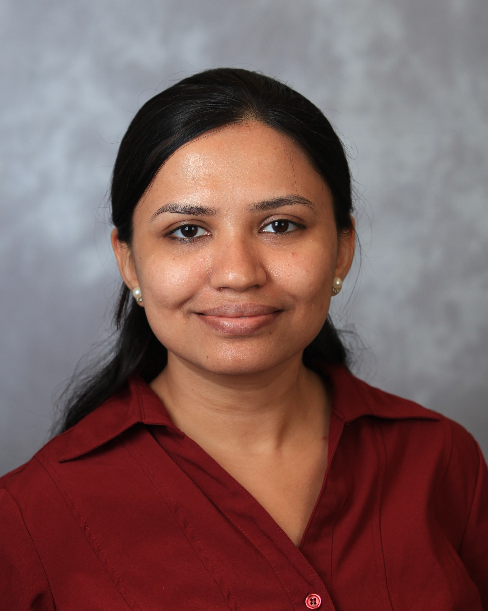
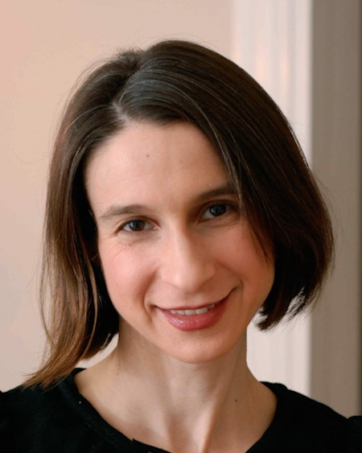

# Welcome to the AME Lab!
{: .fs-9 }

The Almost Matching Exactly Lab provides a range of matching methods for causal 
inference using statistical machine learning algorithms.
{: .fs-6 .fw-300 }

[View us on GitHub](https://github.com/almost-matching-exactly){: .btn .fs-5 .mb-4 .mb-md-0 }

---

## About
The Almost Matching Exactly Lab is a joint venture of the Departments of Computer Science and 
Statistics at Duke University in Durham, North Carolina. Our goal is to develop and apply interpretable
machine learning algorithms to estimate causal effects using observational data. In general, our
algorithms match units with similar covariate distributions, creating high quality, exact or almost
exact matches for treatment effect estimation. To learn more about how these algorithms work, visit
our [algorithm overview](overview) page or read one of our [publications](publications). To begin 
using one of our matching methods, choose a [software package](software) and get started!

## People

<table class="people">
  <thead>
    <tr>
        <th class="d-large" colspan="3"><h3>Professors</h3></th>
        <th class="d-small"><h3>Professors</h3></th>
    </tr>
  </thead>
  <tbody>
    <tr>
        <td>
            <a href="https://users.cs.duke.edu/~sudeepa/">
                  
                <h3>Sudeepa Roy</h3>
                Computer Science
            </a>
        </td>
        <td>
            <a href="https://users.cs.duke.edu/~cynthia/">
                  
                <h3>Cynthia Rudin</h3>
                Computer Science
            </a>
        </td> 
        <td>
            <a href="https://volfovsky.github.io/">
                  
                <h3>Alexander Volfovsky</h3>
                Statistics
            </a>
        </td>
    </tr>
  </tbody>
  <thead>
    <tr>
        <th class="d-large" colspan="3"><h3>Graduate Students</h3></th>
        <th class="d-small"><h3>Graduate Students</h3></th>
    </tr>
  </thead>
  <tbody>
    <tr>
        <td>
            <a href="https://nehargupta.github.io/">
                  
                <h3>Neha Gupta</h3>
                Economics and Computer Science
            </a>
        </td> 
        <td>
            <a href="https://marcomorucci.com//bio/">
                  
                <h3>Marco Morucci</h3>
                Political Science
            </a>
        </td>
        <td>
            <a href="https://vittorioorlandi.github.io/">
                  
                <h3>Vittorio Orlandi</h3>
                Statistics
            </a>
        </td>
    </tr>
    <tr>
        <td>
            <a href="https://sites.google.com/view/harshparikh/">
                  
                <h3>Harsh Parikh</h3>
                Computer Science
            </a>
        </td>
        <td>
            <a href="https://www.linkedin.com/in/xian-sun-9874a9199/">
                  
                <h3>Xian Sun</h3>
                Computer Science
            </a>
        </td> 
        <td>
            <a href="https://www.linkedin.com/in/musaidawan/">
                  
                <h3>Muhammad Usaid Awan</h3>
                Economics
            </a>
        </td>
    </tr>
    <tr>
        <td>
            <a href="https://www.cs.duke.edu/people/graduates/705">
                  
                <h3>Tianyu Wang</h3>
                Computer Science
            </a>
        </td>
    </tr>
  </tbody>
  <thead>
    <tr>
        <th class="d-large" colspan="3"><h3>Undergraduates</h3></th>
        <th class="d-small"><h3>Undergraduates</h3></th>
    </tr>
  </thead>
  <tbody>
    <tr>
        <td>
            <a href="https://www.linkedin.com/in/thomasjhowell">
                  
                <h3>Thomas Howell</h3>
                Computer Science and Mechanical Engineering
            </a>
        </td> 
        <td>
            <a href="https://www.linkedin.com/in/angikarghosal/">
                  
                <h3>Angikar Ghosal</h3>
                Computer Science
            </a>
        </td>
    </tr>
  </tbody>
</table>